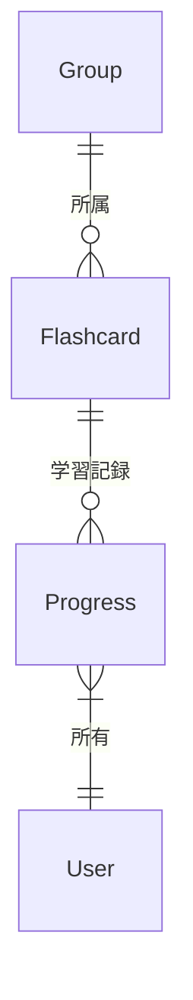

# データモデル設計

## 1. データモデル概要

アプリケーションは以下の 3 つの主要なデータモデルで構成されています：

1. フラッシュカード（Flashcard）
2. グループ（Group）
3. 進捗状況（Progress）

## 2. 詳細仕様

### 2.1 フラッシュカード（Flashcard）

フラッシュカードの基本情報を管理するモデルです。

```typescript
interface Flashcard {
  id: string; // カード固有のID
  question: string; // 問題文
  answer: string; // 解答
  explanation: string; // 解説
  groupId: string; // 所属するグループのID
  createdAt: string; // 作成日時（ISO 8601形式）
  updatedAt: string; // 更新日時（ISO 8601形式）
}
```

### 2.2 グループ（Group）

フラッシュカードをグループ化する単位です。資格や学習テーマごとに作成します。

```typescript
interface Group {
  id: string; // グループ固有のID
  name: string; // グループ名（例: "Pega Certified System Architect"）
  totalCards: number; // グループ内のカード総数
  createdAt: string; // 作成日時（ISO 8601形式）
  updatedAt: string; // 更新日時（ISO 8601形式）
}
```

### 2.3 進捗状況（Progress）

ユーザーの学習進捗を管理するモデルです。

```typescript
interface Progress {
  userId: string; // ユーザーID
  cardProgress: {
    cardId: string; // カードID
    status: "correct" | "incorrect"; // 回答状態
    lastReviewed: string; // 最後にレビューした日時
    reviewCount: number; // レビュー回数
    createdAt: string; // 作成日時
    updatedAt: string; // 更新日時
  }[];
  createdAt: string; // 作成日時（ISO 8601形式）
  updatedAt: string; // 更新日時（ISO 8601形式）
}
```

## 3. データの関係性



## 4. データストレージ

### 4.1 ローカルストレージ（AsyncStorage）

- フラッシュカードデータ: `@oboeru-card/flashcards`
- グループデータ: `@oboeru-card/groups`
- 進捗データ: `@oboeru-card/progress`

### 4.2 データ永続化

- アプリ起動時にローカルストレージからデータを読み込み
- データ更新時に自動的にローカルストレージに保存
- 定期的なバックアップ機能は将来の拡張として検討

## 5. データ制約

### 5.1 バリデーションルール

- ID: 一意の文字列（UUID v4 を使用）
- 日時: ISO 8601 形式（UTC）
- 文字列フィールド: 最大長は以下の通り
  - question: 1000 文字
  - answer: 1000 文字
  - explanation: 2000 文字
  - name: 100 文字

### 5.2 データ整合性

- フラッシュカードは必ず 1 つのグループに所属
- 存在しないグループ ID は参照不可
- 全てのタイムスタンプは UTC 形式で保存
