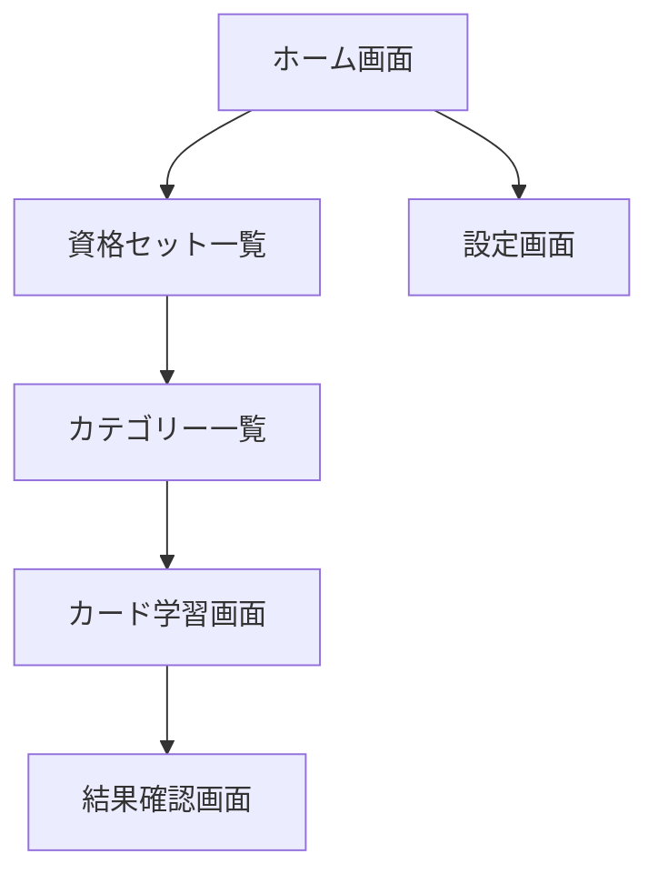

# 画面設計仕様書

## 1. 画面構成概要



## 2. 画面詳細

### 2.1 ホーム画面（Home）

#### レイアウト構成

- ヘッダー
  - アプリタイトル
  - 設定ボタン
- メインコンテンツ
  - 資格セット一覧
  - 各資格の進捗状況
- フッター
  - 総合進捗状況

#### UI 要素

```typescript
interface HomeScreenProps {
  examSets: {
    id: string;
    name: string;
    progress: number;
    totalCards: number;
    completedCards: number;
  }[];
}
```

### 2.2 資格セット一覧画面（ExamSetList）

#### レイアウト構成

- ヘッダー
  - 戻るボタン
  - 画面タイトル
- リスト表示
  - 資格セット名
  - 進捗バー
  - 達成率

#### UI 要素

```typescript
interface ExamSetListItemProps {
  name: string;
  progress: number;
  totalCards: number;
  lastStudied: string;
}
```

### 2.3 カテゴリー一覧画面（CategoryList）

#### レイアウト構成

- ヘッダー
  - 戻るボタン
  - 資格セット名
- カテゴリーリスト
  - カテゴリー名
  - 進捗状況
  - カード数

#### UI 要素

```typescript
interface CategoryListItemProps {
  name: string;
  progress: number;
  cardCount: number;
  isCompleted: boolean;
}
```

### 2.4 カード学習画面（CardStudy）

#### レイアウト構成

- ヘッダー
  - 戻るボタン
  - 進捗表示
- カードエリア
  - 問題/回答表示
  - めくりアニメーション
- コントロール
  - 前へ/次へボタン
  - 採点ボタン

#### UI 要素

```typescript
interface CardStudyProps {
  currentCard: {
    question: string;
    answer: string;
    explanation: string;
  };
  progress: {
    current: number;
    total: number;
  };
  isFlipped: boolean;
}
```

### 2.5 結果確認画面（Result）

#### レイアウト構成

- ヘッダー
  - 完了メッセージ
- 結果サマリー
  - 正答率
  - 学習時間
  - カード数
- アクション
  - 復習ボタン
  - 終了ボタン

#### UI 要素

```typescript
interface ResultScreenProps {
  stats: {
    correctCount: number;
    totalCards: number;
    studyTime: number;
    accuracy: number;
  };
}
```

### 2.6 設定画面（Settings）

#### レイアウト構成

- ヘッダー
  - 戻るボタン
  - 画面タイトル
- 設定項目
  - テーマ設定
  - 表示設定
  - データ管理

#### UI 要素

```typescript
interface SettingsScreenProps {
  settings: {
    theme: "light" | "dark" | "system";
    cardAnimation: boolean;
    autoProgress: boolean;
  };
}
```

## 3. 画面遷移

### 3.1 遷移定義

```typescript
type RootStackParamList = {
  Home: undefined;
  ExamSetList: { setId: string };
  CategoryList: { setId: string };
  CardStudy: { categoryId: string };
  Result: { studySessionId: string };
  Settings: undefined;
};
```

### 3.2 ナビゲーション実装

```typescript
const Stack = createStackNavigator<RootStackParamList>();

function AppNavigator() {
  return (
    <Stack.Navigator>
      <Stack.Screen name="Home" component={HomeScreen} />
      <Stack.Screen name="ExamSetList" component={ExamSetListScreen} />
      <Stack.Screen name="CategoryList" component={CategoryListScreen} />
      <Stack.Screen name="CardStudy" component={CardStudyScreen} />
      <Stack.Screen name="Result" component={ResultScreen} />
      <Stack.Screen name="Settings" component={SettingsScreen} />
    </Stack.Navigator>
  );
}
```

## 4. スタイルガイド

### 4.1 カラーパレット

```typescript
const colors = {
  light: {
    primary: "#007AFF",
    background: "#FFFFFF",
    surface: "#F2F2F7",
    text: "#000000",
    accent: "#FF9500",
  },
  dark: {
    primary: "#0A84FF",
    background: "#000000",
    surface: "#1C1C1E",
    text: "#FFFFFF",
    accent: "#FF9F0A",
  },
};
```

### 4.2 タイポグラフィ

```typescript
const typography = {
  h1: {
    fontSize: 28,
    fontWeight: "bold",
  },
  h2: {
    fontSize: 22,
    fontWeight: "600",
  },
  body: {
    fontSize: 17,
    fontWeight: "normal",
  },
  caption: {
    fontSize: 13,
    fontWeight: "normal",
  },
};
```

### 4.3 スペーシング

```typescript
const spacing = {
  xs: 4,
  sm: 8,
  md: 16,
  lg: 24,
  xl: 32,
};
```

## 5. アニメーション仕様

### 5.1 カードめくり

```typescript
const flipConfig = {
  duration: 300,
  easing: Easing.inOut(Easing.ease),
  useNativeDriver: false,
};
```

### 5.2 画面遷移

```typescript
const transitionConfig = {
  animation: "slide_from_right",
  duration: 250,
};
```
